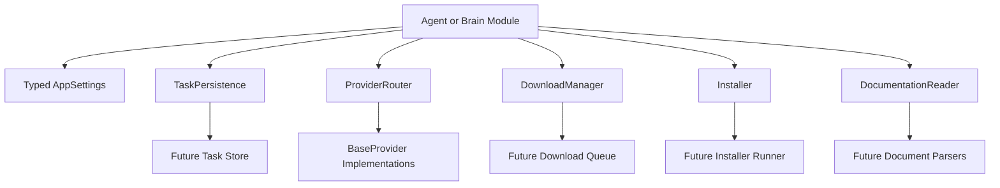

# Core Infrastructure

JARVIS OS is designed as an AI operating system, not a chatbot. The core infrastructure exists to make every future feature modular, replaceable, and provider-neutral.

No AI behavior, downloading, installing, document parsing, or automation execution is implemented at this stage. The current code defines contracts, configuration, and documentation so future prompts can add behavior without refactoring the foundation.

## Design Decisions

### Configuration Is Centralized

All runtime configuration flows through `config.load_settings()`. Settings are loaded in this order:

1. Built-in defaults from `config/defaults.py`
2. `config.yaml`
3. `.env`
4. Process environment variables

Later layers should receive the typed `AppSettings` object instead of reading files or environment variables directly. This keeps settings predictable and testable.

### Providers Are Replaceable

The provider layer defines a `BaseProvider` interface and a `ProviderRouter`. The router accepts provider instances through dependency injection and does not construct or import concrete providers internally.

This keeps the system independent from OpenAI, Anthropic, Google, OpenRouter, local models, or any future provider.

### Task State Is Provider-Neutral

Task persistence stores the goal, progress, steps, files, generated code, referenced documents, current provider, and timestamp. It does not store provider-specific runtime objects.

This allows work to resume later or continue after switching to another configured provider.

### External Actions Are Planned Before Execution

Downloads, installations, documentation reading, and automation are represented as interfaces and data models. Future implementations should create plans, reports, and progress events before performing privileged or external actions.

This supports safety, auditability, rollback, and user confirmation.

## Module Responsibilities

| Module | Why It Exists |
| --- | --- |
| `config/` | Owns defaults, YAML loading, environment overrides, typed settings, and logging configuration. |
| `providers/` | Defines provider interfaces and routing contracts without binding to any provider API. |
| `tasks/` | Defines task snapshots and persistence contracts so work can resume across sessions. |
| `downloads/` | Defines download request, progress, integrity, queue, and result contracts. |
| `installers/` | Defines installation planning, verification, rollback, and reporting contracts. |
| `documents/` | Defines documentation reading and extraction contracts for Markdown, PDF, HTML, DOCX, and TXT. |
| `agents/` | Future agents will coordinate goals and call infrastructure contracts. |
| `automation/` | Future scheduled or event-driven workflows will run through controlled interfaces. |
| `brain/` | Future high-level orchestration will decide which agents and services should handle a goal. |
| `memory/` | Future long-term and short-term memory systems will store recallable context. |
| `models/` | Future model metadata and model-selection helpers will live here. |
| `plugins/` | Future optional extensions will register providers, skills, integrations, or UI features. |
| `server/` | Future HTTP, WebSocket, or local IPC APIs will expose selected OS capabilities. |
| `skills/` | Future reusable abilities callable by agents will live here. |
| `desktop/` | Future Windows-first desktop integrations will be isolated here. |
| `mobile/` | Future mobile companion integrations will be isolated here. |
| `utils/` | Shared helpers only when they are truly cross-cutting. |

## Communication Flow

Modules communicate through interfaces and typed data objects. Future implementations should be injected into agents or orchestration services instead of imported as globals.

## Adding a New Provider

1. Create a provider class that implements `BaseProvider`.
2. Return accurate capability information from `capabilities()`.
3. Report availability through `is_available()`.
4. Add cost estimation through `estimate_cost()`.
5. Implement `execute()` only when provider behavior is ready.
6. Register the provider instance with `ProviderRouter`.
7. Add provider configuration under `providers.definitions` in `config.yaml`.

The router should remain provider-neutral. It should never contain API keys, provider SDK setup, or provider-specific request logic.

## Future Agent Usage

Future agents should use infrastructure like this:

1. Load settings once at application startup.
2. Receive `ProviderRouter`, `TaskPersistence`, `DownloadManager`, `Installer`, and `DocumentationReader` through dependency injection.
3. Save a `TaskSnapshot` whenever meaningful progress occurs.
4. Ask `ProviderRouter` for provider selection instead of choosing providers directly.
5. Generate installation and execution plans before running commands.
6. Report progress through typed events or task snapshots.

## Boundaries

- `providers/` describes AI provider contracts but does not implement AI behavior.
- `downloads/` describes download work but does not fetch network resources.
- `installers/` describes installation work but does not execute installers.
- `documents/` describes reading and extraction but does not parse files yet.
- `tasks/` describes persistence but does not choose a storage backend yet.

